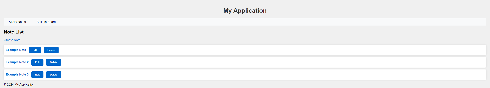
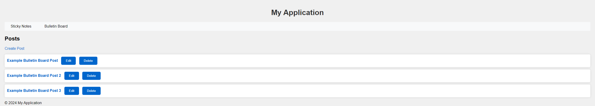
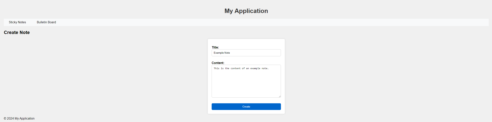
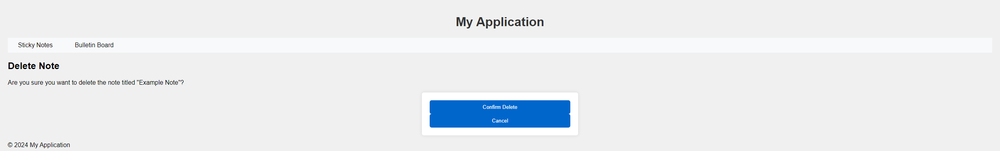

# Sticky Notes Project

## Description

This is a web application that allows users to create and manage sticky notes and bulletin board posts. It demonstrates the use of Django, a Python web framework, to build a functional web application with a user interface. This aspect of coding is important as it combines both front-end and back-end development, which is necessary for full-stack development.

## Table of Contents

- [Description](#description)
- [Installation](#installation)
- [Usage](#usage)
  - [Screenshots](#screenshots)
- [Credits](#credits)

## Installation

To install and run this project, follow the below steps:

1. **Clone the repository:**
   ```sh
   git clone https://https://github.com/ashton8257/Sticky_Notes.git
   cd Sticky_Notes

2. **Create a virtual environment:**
   ```sh
   python -m venv venv
   .\.venv\Scripts\activate

3. **Install the required dependencies:**
   ```sh
   pip install -r requirements.txt

4. **Run database migrations:**
   ```sh
   python manage.py migrate

5. **Run the server:**
   ```sh
   python manage.py runserver

## Usage

To use the Sticky Notes and Bulletin Board application, follow the following steps:

1. **Access the web application:**
   - Open a web browser and go to `http://127.0.0.1:8000`.

3. **Navigate through the application:**
   - Use the navigation links at the top of the page to access the sticky notes or bulletin board application.
   - Create, edit, delete, and view notes/posts as needed.

### Screenshots

**Sticky Notes List:**


**Bulletin Board Posts:**


**Creating a Note/Post:**


**Deleting a Note/Post:**


## Credits

This project was developed by [Ashton](https://github.com/ashton8257/)
